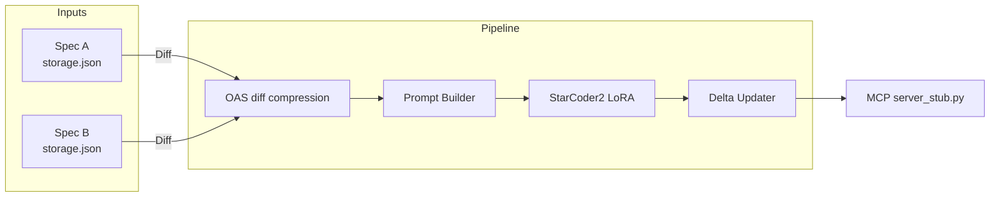

# Δ DeltaMCP

<p align="center">
	
	
	
	
</p>

DeltaMCP is an incremental Model Context Protocol (MCP) generator that fine-tunes an LLM to keep your server stubs in sync with evolving OpenAPI specifications—without rewriting the world.

<details>
<summary><strong>Table of Contents</strong></summary>

- [Why DeltaMCP?](#why-deltamcp)
- [How It Works](#how-it-works)
- [Key Features](#key-features)
- [Quick Start](#quick-start)
- [Manual Evaluation Workflow](#manual-evaluation-workflow)
- [Artifacts & Visualizations](#artifacts--visualizations)
- [Project Layout](#project-layout)
- [Contributing](#contributing)
- [License](#license)

</details>

## Why DeltaMCP?

Traditional MCP generation pipelines (like the baseline AutoMCP) regenerate entire stubs for every spec revision. DeltaMCP flips that workflow on its head:

- **Diff-aware updates** – only tools touched by a spec delta are regenerated.
- **Low resource footprint** – StarCoder2 LoRA weights + smart batching mean lighter CPU and memory usage.
- **Frictionless integration** – generated tools carry `#added with DeltaMCP` and `#updated with DeltaMCP` markers so downstream merges stay clean.

## Research Problem & Questions

**Problem statement**: Can we upgrade MCP servers without fully regenerating them when OpenAPI specifications evolve?

- How can we efficiently detect meaningful differences between OpenAPI specification versions?
- How can those detected changes be routed to targeted MCP tool updates rather than wholesale regeneration?
- What performance gains emerge when we incrementally regenerate servers compared to a full rebuild pipeline?

> 67% of global institutions have already adopted LLM solutions, making incremental automation workflows more valuable than ever.

## Data Description & Task

- **Namespace**: `Microsoft.Storage`
- **Dataset**: Versioned OpenAPI specifications plus baseline MCP stubs generated by AutoMCP.
- **Scope**: Moderately sized API surface, ideal for diff-based fine-tuning experiments.
- **Samples**: >1149 training examples derived from spec deltas and existing tool implementations.

The task is to transform sequential spec updates into aligned training triples (spec A, spec B, tool context) that teach an LLM to emit only the required MCP tool adjustments.

## Methodology Overview

| Phase | Focus | Highlights |
| --- | --- | --- |
| 00 | Baseline MCP & Benchmarking | AutoMCP builds the initial server (spec `2015-06-15`) used as ground truth |
| 01 | Data Collection & Prep | JSON diff extraction, cleanup, prompt assembly, and tagging |
| 02 | LLM Fine-tuning | StarCoder2-7B, Phi-3, and CodeLlama-7B adapters trained on the curated samples |
| 03 | Adapter, Interface & Inference | CLI-based interface, threaded inference, and upsert logic integrate the model output |

Training leveraged a NVIDIA GH200 (480 GB) environment using LoRA adapters to keep checkpoints lightweight.

## How It Works



1. **Diff builder** compresses OpenAPI deltas.
2. **Prompt builder** feeds the model only the relevant tool plus change summary.
3. **LLM generator** updates the tool implementation.
4. **Updater** writes the new tool back with perfect indentation, deduplication, and audit tags.

## Key Features

- 🔁 **Incremental generation** – `DeltaMCPGenerator` injects only the necessary changes.
- 🧠 **LoRA fine-tuning** – optimized StarCoder2 weights stored in `DeltaMCP/llm-finetuned`.
- 🧪 **Manual evaluation harness** – `DeltaMCP/manual_eval.py` tracks coverage, downtime, resource usage, and tool churn.
- 🛠 **Comment-tagged updates** – every touched tool is marked for easy code review.

## Quick Start

```bash
# 1. Create the runtime (micromamba recommended)
micromamba env create -f env/deltamcp-star-environment.yaml
micromamba activate deltamcp-star

# 2. Ensure fine-tuned weights are available under DeltaMCP/llm-finetuned

# 3. Run the generator against two spec versions
python -m DeltaMCP.main \
	--stub-a AutoMCP/generated/2015-06-15/server_stub.py \
	--spec-a azure-rest-api-specs/specification/storage/resource-manager/Microsoft.Storage/stable/2015-06-15/storage.json \
	--spec-b azure-rest-api-specs/specification/storage/resource-manager/Microsoft.Storage/stable/2016-01-01/storage.json \
	--output DeltaMCP/generated/manual/2016-01-01/server_stub.py \
	--model deltamcp-starcoder2-lora

# 4. Inspect the updated stub (audit tags show touched tools)
sed -n '1,80p' DeltaMCP/generated/manual/2016-01-01/server_stub.py
```

The CLI accepts any compatible pair of baseline stub + `storage.json` specs. If `--output` is omitted, DeltaMCP writes beside `--stub-a` using the target spec name.

## Contributing

1. Fork it 🍴
2. Create your feature branch: `git checkout -b feat/amazing`
3. Commit your changes with clear messages
4. Open a pull request describing coverage impact & diff size

We welcome improvements to diff handling and updates.

## License

This project inherits the licensing terms of the upstream `azure-rest-api-specs`. See [`azure-rest-api-specs/LICENSE`](azure-rest-api-specs/LICENSE) for details.

---

<p align="center"><em>Keep calm and let the deltas flow.</em></p>

<sub>1. Internal estimate based on 2025 market adoption surveys.</sub>
